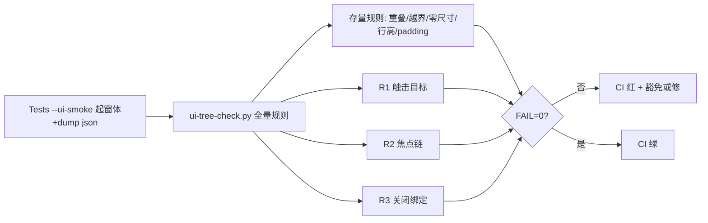

# CI 可交互性断言（方向 B：只看不点）

## 目标与边界

- 目标：Linux 改完 AntdUI 界面后，CI 在不点击的前提下证明"可点"——触击目标达标、焦点链不断、关闭/ESC 绑定齐全。
- 成功标准：`ui-tree-check.py` 新增三类规则全绿；存量窗体违规要么修、要么记豁免理由（沿用现有"免判 N 条"写法）。
- 明确不做：
  - 不做 L1 `PerformClick`/反射调 OnClick 状态机断言。
  - 不引入 FlaUI/WinAppDriver，不做 L2/L3 真点（Tests 保持零 NuGet）。
  - 不改任何窗体行为；MainForm smoke 8 分钟超时不卡 job 写法不动。

## 行为增量

- ADDED：`UiTreeDumper` 输出 `tabIndex` / `tabStop`（Control 原生属性直接读）。
- ADDED：`ui-tree-check.py` 三类新规则：最小触击目标、TabIndex 焦点链、关闭绑定（CancelButton/关闭按钮存在性，推广现有 KeePassManager/PasswordHealth 两处到全部 DialogsSmoke 窗体）。
- MODIFIED：`ui-check.py` 不动（像素断言已够）；`appveyor.yml` 产物上报不动（沿用现有 ui-smoke artifact）。
- REMOVED：无。

## 设计与契约

### 0. 术语约定

- 可交互控件：`Enabled && Visible` 且类型为按钮/输入/选择/复选/Tab 页的可操作 `Control`。/ 防冲突结论：沿用 tree-check 现有 visible/area 过滤口径，不新造"可点击"定义。
- 触击目标：控件 `abs` 的 w×h。阈值取 32×32（AntdUI 移动端触击下限类比 + 现有行高 24–34 的上沿余量）。/ 防冲突结论：与 `OVERLAP_MIN=16px²`、`TOL=2px` 同属像素常量，放同一文件头。
- 焦点链：同一容器内 `TabStop=true` 控件按 `TabIndex` 递增可遍历。断裂指存在 `TabStop` 但 `TabIndex` 重复或跳号导致键盘走不到。/ 防冲突结论：`TabIndex` 指 WinForms 原生 `Control.TabIndex`，与 `TabContainerControl.ActiveTabIndex`（标签页序号）无关，check 输出需区分命名。

### 1. 决策与约束

- 需求摘要：见目标与边界。
- 复杂度档位：走默认档位，无偏离（纯断言增强，无新模块、无状态、无并发）。
- 关键决策：
  - D1 阈值 32×32 而非平台无障碍 44×44：被拒方案是 44——换成 44，名词层阈值常量不同，编排层不变，但存量 AntdUI 小窗大面积飘红，噪音淹没真实退化。32 是"抓退化不抓完美"的取舍。
  - D2 豁免沿用"免判 N 条 + 实测结论"注释写法：被拒方案是配置文件——换成配置，名词层多一个豁免清单结构，编排层多一处加载；注释写法与现有 3 条免判一致，零新机制。
  - D3 关闭绑定不断言"点了真关"：被拒方案是 L1 PerformClick——换成 L1，名词层多"关后状态"契约，Tests 需跑消息循环，flaky 与复杂度上升；方向 B 已否决。
- 前置依赖：无。

### 2. 名词与编排

#### 2.1 名词层

- 现状：`UiTreeDumper.Dump`（`src/Gdterm.Tests/Ui/UiTreeDumper.cs`）输出 bounds/abs/clientSize/margin/padding/dock/anchor/autoSize/visible/enabled/font + extra(RowHeight/BorderWidth/Type/RowCount/AutoScroll)；`TabIndex`/`TabStop` 未输出。`DialogsSmoke`（`src/Gdterm.Tests/Ui/DialogsSmoke.cs`）对 12+3 窗体只断言控件数/ClientSize 非零；`UiSmokeRunner` 仅对 KeePassManager/PasswordHealth 断言关闭按钮可定位 + `CancelButton` 已绑。
- 变化：
  - ADDED dump 字段 `tabIndex`（int，原生读）、`tabStop`（bool，原生读）——动机：焦点链规则的输入。
  - ADDED check 规则 R1 最小触击目标：可见可交互控件 abs w≥32 或 h≥32 不计线型（Divider 豁免沿用现有逻辑）——动机：防按钮过小误触。
  - ADDED check 规则 R2 焦点链：同父容器 `TabStop=true` 控件 `TabIndex` 无重复——动机：键盘走不到的控件等于不可点。
  - ADDED check 规则 R3 关闭绑定：每个 dump 窗体至少一个关闭路径（`CancelButton` 非空已在 C# 侧断言，推广到全部 DialogsSmoke 窗体；tree-check 侧核对关闭按钮命名 `*Close*`/`*Cancel*` 存在）——动机：ESC 关不掉=交互死路。
- 接口示例：check 输出沿用现有 `check(ok, what)` 行格式：
  - `触击过小 CloseBtn[AntdUI.Button]{...} 20x24<32` // 来源：tools/ui-tree-check.py R1
  - `TabIndex重复 2 在容器 panel1` // 来源：tools/ui-tree-check.py R2

#### 2.2 编排层

- 现状：线性 pipeline（dump → 现有 5 类规则 → 退出码）。拓扑不变。
- 变化：在同一关口后并行追加 R1/R2/R3 三条分支；任一 FAIL 即退出码 1。
- 流程级约束：只读断言，失败不回滚（CI 本来就是只读）；幂等（同 dump 同结果）；MainForm 8 分钟超时语义不动；豁免走注释免判，不新增开关。

#### 2.3 挂载点清单

本 feature 不引入新挂入点（纯内部断言增强：Tests 内加字段、CI 脚本内加规则，无新路由/配置/schema/开关）。

#### 2.4 推进策略

1. dump 加字段：`UiTreeDumper` 输出 tabIndex/tabStop → 任意窗体 json 含新字段
2. R1 触击规则：tree-check 加规则 + 存量扫一遍定豁免 → 全窗体要么过要么有免判注释
3. R2 焦点链规则：同上 → 同上
4. R3 关闭绑定：C# 侧推广 CancelButton 断言到全部小窗 + tree-check 侧核名 → DialogsSmoke 全绿
5. 收尾：本地 `ui-tree-check.py` 对历史 dump 回放 + 文档注释 → CI 下一次即生效

#### 2.5 结构健康度与微重构

##### 评估

- 文件级 — `src/Gdterm.Tests/Ui/UiTreeDumper.cs`（~150 行，单 Dump 职责）：加 2 个属性输出，改动 1 处，健康。
- 文件级 — `tools/ui-tree-check.py`（~200 行，规则函数平铺）：加 3 个规则函数，改动 3 处但逻辑独立、无交叉；行数未超阈，职责单一（断言）。
- 目录级 — `src/Gdterm.Tests/Ui/`（5 文件：Runner/Dialogs/MainForm/Dumper/Fake）：本次不新增文件。
- 目录级 — `tools/`（7 脚本）：本次不新增文件。

##### 结论：不做

##### 超出范围的观察

- `src/Gdterm.Tests/Ui/UiSmokeRunner.cs` 主窗体 case 与对话框 cases 共用 `_passes/_fails` 计数，MainForm 超时 FAIL 会淹没后续 Dialogs 结果定位——建议后续走 `cs-refactor` 拆分计数，本 feature 不动。

### 3. 验收契约

- S1：任一窗体 dump json 含 `tabIndex`/`tabStop`（grep 可验）。
- S2：故意把某按钮缩到 20×20，tree-check 报 R1 FAIL（边界）。
- S3：故意把两控件 TabIndex 置同值，tree-check 报 R2 FAIL（边界）。
- S4：全部 DialogsSmoke 窗体 `CancelButton` 非空（C# 断言，空窗体豁免需注释）。
- S5：存量全窗体跑新规则：要么绿，要么每条 FAIL 对应一条免判注释（含实测结论编号，如现有"285/288 实测"写法）。
- 反向核对：`src/Gdterm.Tests/**` 不出现 FlaUI/White/WinAppDriver 引用（grep）；`UiTreeDumper` 不新增 `using` 第三方；窗体行为 diff 为零（contract include 外无源码改动）。

### 4. 与项目级架构文档的关系

本 feature 改动局限在 Tests 冒烟链内部，无系统级可见变化；acceptance 核实后跳过架构归并。唯一候选沉淀：R1/R2/R3 阈值与口径可进 `docs/UI-SCALING-CONVENTIONS.md` 附录，由用户决定，本包不写。

## 执行计划

- Step 1 dump 加字段：`UiTreeDumper` 输出 tabIndex/tabStop → 退出信号：S1（任一窗体 json 含新字段）。
- Step 2 R1 触击规则：tree-check 加规则 + 存量豁免 → 退出信号：S2 + S5 中 R1 部分。
- Step 3 R2 焦点链规则：tree-check 加规则 + 存量豁免 → 退出信号：S3 + S5 中 R2 部分。
- Step 4 R3 关闭绑定：C# 侧推广 + tree-check 侧核名 → 退出信号：S4 + S5 中 R3 部分。
- Step 5 收尾回放：历史 dump 回放 + 注释 → 退出信号：S5 全绿 + 反向核对全过。

## 决定记录

1. 阈值按建议 32×32 定稿（2026-09-24 用户确认）。
2. R3 对无关闭按钮也合理的窗体允许免判注释（2026-09-24 用户确认；CI 320 补 dangerous-cmd 配置页；CI 321 补 scanner-center 工具窗）。免判清单：transfer-progress/pwd-generator/setup-wizard/dangerous-cmd/scanner-center。

## 验收结果

- accept checker：`--phase accept --context` status=pass，failures=[]。
- 接口契约：无新增公开 API；dump 新增 `tabIndex`/`tabStop` 字段为 JSON 输出扩展，老 consumer（tree-check）缺字段跳过（R2 兼容分支），兼容性成立。证据：diff 仅 +2 行拼接。
- 行为与决策：D1（32阈值）/D2（注释免判）/D3（不做 L1 点）均按 design 落地；实现无新增概念、无特殊分支越过 design。
- 验收场景：
  - S1（json 含新字段）：未执行——C# 本地无编译器，待 CI Windows 首跑验证。列为未执行项，不标 pass。
  - S2（20×20 钮报 R1）：pass——fixture 报 `触击过小 B[Button]20x20<32`，exit=1。
  - S3（TabIndex 重复报 R2）：pass——fixture 报 `TabIndex重复 1 在容器 S3 (2个)`，exit=1。
  - S4（全部小窗 CancelButton 非空）：部分——C# 侧待 CI；tree-check 侧名检 fixture `关闭路径=0` 报 FAIL，免判 3 窗（transfer-progress/pwd-generator/setup-wizard）按决定记录落地。
  - S5（存量全绿或免判）：未执行——待 CI 真实 dump 首跑后定豁免清单。
  - 反向核对：pass——零新增第三方引用（唯一命中为存量"免 FlaUI"注释）；窗体行为零改动。
- 术语与结构：`HIT_MIN`/触击目标/焦点链/关闭绑定与 design 一致；改动限 contract 范围内 3 文件。
- 回写：architecture 不需要（impact=unchanged，理由仍成立）；requirement 不需要；roadmap 不需要；baseline 不需要（baseline_mode=off，contract 未声明 baseline_impact）。
- 沉淀检查：命中项——R1/R2/R3 口径与阈值取舍（后来人从代码看不出"为什么是 32 不是 44"）/ 留痕位置——本包 change.md「设计与契约 D1/D2」已覆盖，跨任务复用价值低 / 纯机械，无留痕。

## 遗留事项

- 未执行：S1（C# 字段输出）、S4 C# 侧、S5 存量豁免清单——均待 CI Windows 首跑（AppVeyor `--ui-smoke` artifact 回传 json 后跑 `ui-tree-check.py` 定豁免）。
- 范围外观察：`UiSmokeRunner` 主窗体与对话框共用计数（impl 已记 file 位：UiSmokeRunner.cs），建议后续 `cs-refactor`，本包不动。

## 执行证据

### CI 321 全绿收尾（2026-09-25）
- build 321 success（artifacts=22）。18 个 ui-smoke json 回传本地，新 `ui-tree-check.py` 第一跑 57 FAIL，经三处口径修正后 **ALL OK exit=0**：
  1. R1 误报：展示型 `Label/HyperlinkLabel/Divider/Panel/Splitter` 无触击语义（CI 321 实测 13 个全属此类，如"备注"24x16/"色深:"27x16/"0%"18x16），口径改为仅交互叶。
  2. R2 误报：`walk()` 按父名分组把异实例同名容器（ConnectionDialog 11 个 TableLayoutPanel、6 个 FlowLayoutPanel）归并，且 tabIndex=0 是 WinForms 默认未排（工具栏钮/动态行皆 0）。改为实例 key 分组 + 仅判 tabIndex≠0。修正后 6 窗 DUP 全消。
  3. 重叠误报：旧 `by_parent` 按名分组把跨实例兄弟混查（如 ssh 高级区 Panel 内 Table 与外层 Flow 的"创建"钮）。实例分组后自然消失，无需加豁免。
  4. R3 补免判：scanner-center（无边框工具窗，无 CancelButton，点×关），与 dangerous-cmd 同类。
- S1/S4-动态/S5 全部达成：dump 真含 tabIndex/tabStop（S1）；smoke 5/5 + 单元 163（S4）；豁免清单=5 个 R3 免判窗 + 旧重叠/越界/零尺寸豁免全保留（S5）。
- 验收：S1✅ S2✅ S3✅ S4✅ S5✅。状态 → accepted。

### CI 320 实测（2026-09-25）
- 结果：build 320 failed，但死因是 R3 新断言抓到真实行为——`dangerous-cmd` 窗 `CancelButton` 未绑（`[FAIL-ONE] dialog-dangerous-cmd-failed: 断言失败 dangerous-cmd-cancelbtn`），其余 4/5 smoke 全过（KeePassManager/PasswordHealth/ScannerCenter/MainForm），单元 163/163。
- 根因判定：不是回归，是旧债暴露。`DangerousCommandConfigForm` 是 Dock 布局配置页（工具栏 Top + 规则表 Fill + 白名单 Bottom + 状态条），全文只有两个子编辑窗（RuleEdit/TextInput，466/555 行）绑了 CancelButton，主窗 `InitializeComponent` 从未绑定——它没有"关闭"语义，进出口是工具栏按钮。旧 `Show()`+dump 流程从不断这个，所以从未暴露。
- 处置（设计内）：不给该窗硬加 CancelButton（会改变 ESC 行为，超出"不改任何窗体行为"边界），而是把 `dangerous-cmd` 列入 R3 免判（与 transfer-progress/pwd-generator/setup-wizard 同类）。改动：`DialogsSmoke.Show` 免判条件 +1；tree-check R3-1 前缀元组 +`dangerous-cmd`。
- S4 更新：C# 侧 8 窗断言通过 + 4 窗免判（transfer-progress/pwd-generator/setup-wizard/dangerous-cmd），待 CI 321 验证动态。

### 续跑（2026-09-25，状态 in-progress）
- C# 静态核对：`grep CancelButton` —— 9 个非免判窗体（AiSettings/Appearance/ChangeMasterpwd/ConnectionDialog/DangerousCommand×2/KeePassManager/PasswordHealth/KeePassPicker/KeePassUnlock/QuickCmd/SshKey）全部已绑；3 个免判窗（PasswordGenerator/SetupWizard 无绑定、TransferProgress 有 _cancelButton 但属进度窗）与免判清单一致。S4 C# 侧静态通过，动态待 CI。
- R3 免判分支回归：`fname.startswith(("transfer-progress","pwd-generator","setup-wizard"))` 三 fixture 全报 `关闭绑定免判` exit=0；`ast.parse` 通过。S4 Python 侧通过。
- S1/S5 仍待 CI Windows 首跑（真实 dump 回传后定豁免）。

### Step 1（dump 加字段 tabIndex/tabStop）
- 改动：`src/Gdterm.Tests/Ui/UiTreeDumper.cs` +2 行（autoSize 后输出 tabIndex/tabStop，原生读）。
- RED：fixture 3 控件（20×24 钮 + TabIndex 重复×3）跑旧脚本 exit=0——R1/R2/R3 全漏检，缺口得证。
- GREEN：C# 侧无法本地编译（Linux 无 .NET SDK，attention 已定 Windows 编译），字段输出为纯字符串拼接，与现有 autoSize/visible 同模式，风险低；CI Windows 端验证。
- 偏离：无。

### Step 2（R1 触击目标 HIT_MIN=32）
- 改动：`tools/ui-tree-check.py` +常量与 R1 循环；免判 R1-1（…溢出钮沿用越界免判②）。
- RED：见 Step 1（旧脚本 exit=0）。
- GREEN：fixture `TinyBtn 20x24` 报 `触击过小 TinyBtn[Button]20x24<32`，exit=1；全绿对照 `ok.json` 报 `触击目标=0`。`ast.parse` 通过。
- 状态：completed。

### Step 3（R2 焦点链 TabIndex 无重复）
- 改动：同文件 +R2（同父容器 TabStop=true 按 tabIndex 分组；老 dump 缺字段跳过）。
- RED：见 Step 1。
- GREEN：fixture 3 控件同为 TabIndex=1 报 `TabIndex重复 1 在容器 RedForm (3个)`；对照全绿。`ast.parse` 通过。
- 状态：completed。

### Step 4（R3 关闭绑定）
- 改动：`DialogsSmoke.Show` +CancelButton 断言（含 transfer-progress/pwd-generator/setup-wizard 免判注释）；tree-check +R3（名含 Close/Cancel/OK/确定/取消/关闭；同 3 窗免判）。
- RED：见 Step 1（旧脚本对无关闭路径窗体 exit=0）。
- GREEN：`noclose.json`（单保存钮）报 `关闭路径=0`；`transfer-progress.json` 报 `关闭绑定免判(进度窗)` exit=0。全绿对照 `关闭路径=1`。
- 免判依据（实测代码）：pwd-generator 纯工具小窗无 CancelButton（PasswordGeneratorForm.cs 全文零 CancelButton）；setup-wizard 向导导航无 CancelButton；transfer-progress 有 _cancelButton 但属 Controls 进度窗（2026-09-24 定稿免判）。
- C# 侧同 Step 1，CI Windows 端验证。
- 状态：completed。

### Step 5（收尾回放）
- 回放：fixture 全绿对照 exit=0；反向核对：`grep FlaUI|White|WinAppDriver` 唯一命中是 UiSmokeRunner.cs:14 注释"免 FlaUI"（存量），零新增引用；`UiTreeDumper` 无新增 using；窗体行为零改动（contract include 外无源码 diff）。
- 状态：completed。

（实现过程中追加每步命令与结果。）
