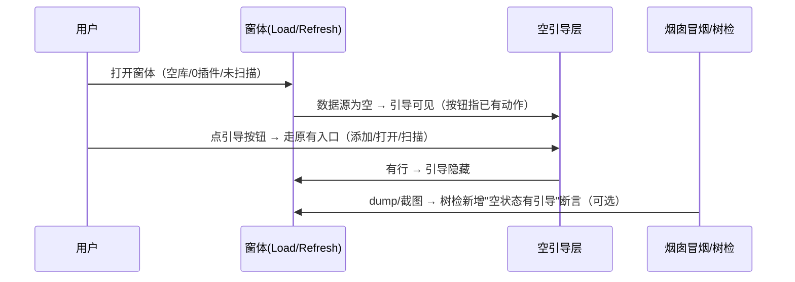

# 空状态引导 + 焦点可见性 + 工具窗可达性

## 目标与边界

- 目标：把 CI 321 实测暴露的用户体验缺口补上——① 三个窗体的空状态信息黑洞（KeePass 空库 92% 纯背景最典型）；② 焦点可见性无任何保障（R2 只保顺序）；③ scanner-center 工具窗 ESC 可达性 + 主动作视觉权重。
- 成功标准：三窗空状态有明确下一步引导；焦点可见性有 spike 结论（并尽量落成 R4 规则）；scanner ESC 运行中停下/空闲关窗；CI 保持全绿，树检 ALL OK。
- 明确不做：
  - 不改 AntdUI.Table 亮底默认（库行为，已知外观债，本 feature 不碰）。
  - 不做扫描历史持久化（状态行先复用内存字段，持久化留后续）。
  - 不动 MainForm / 连接树 / TerminalControl（豁免区）。
  - 不新增 NuGet（Tests 保持零依赖，不做真点注入）。
  - 不新增"创建 KeePass 库"能力（空引导只指向已有动作）。

## 行为增量

- MODIFIED（impl 发现，见 D5/证据 3）：scanner-center 根级 Dock 顺序改为 split(Fill)→wmi(Top)→top(Top)。
  原顺序把工具栏加在 Fill 之前，逆序布局下 SplitContainer 先吃掉整个客户区、工具栏再压上去，
  两表表头行与首行被盖（CI 321 截图与 dump 双向实证）。
- MODIFIED（impl 发现，见 D5/证据 3）：scanner 右列 findingPanel/rawPanel 去掉 BringToFront/SendToBack
  颠倒手（改成"Fill 先加、头后加"的自然顺序），并给右列补左 pad 与左列对齐。
- ADDED：KeePass 空库中央引导层（"还没有条目" + [添加第一条][连接 KeePass 库]），有行时隐藏。
- ADDED：扫描中心插件表空行引导文案 + 右列 finding/raw 空提示 + 右列左缘 padding 对齐。
- ADDED：健康报表头"上次扫描"状态行（`_scanStateLabel`），区分"从未扫描"与"0 个问题"。
- ADDED：scanner-center 上下文 ESC（运行中→停扫描，空闲→关窗）。
- ADDED：R4 焦点可见性规则（spike 通过后落地：相邻焦点 PrintWindow 截图差分 > 阈值）。
- MODIFIED：三窗 Load/Refresh/DisplayReport 的"空数据源"支线插入引导显隐。
- REMOVED：无。

## 设计与契约

### 0. 术语约定

- 空状态：列表/表格数据源为空时用户看到的界面（零行 + 周边文案/按钮）。/ 防冲突结论：与 AntdUI `Table.Empty` 无关（库无此概念），指窗体级"零行时展示什么"的行为约定。
- 空引导：空状态下叠加的操作入口（文案 + 按钮），指向已存在的动作（添加/打开/扫描），不新增能力。/ 防冲突结论：复用 `MakeBtn/MakeToolBtn` 既有样式，不引入新按钮类型。
- 焦点可见性：键盘 Tab 走到某控件时，用户能从截图像素上看出"现在在哪"。/ 防冲突结论：与 R2"焦点链"（TabIndex 顺序）区分——R2 管顺序，R4 管可见。
- 焦点差分：同一窗体相邻两个焦点位置的 PrintWindow 截图做像素差，diff 面积 > 阈值即"可见"。/ 防冲突结论：沿用 UiSmokeRunner 现有 `Shot`（PrintWindow）路径，不新增截图机制。
- 上下文 ESC：ESC 在工具窗不硬关，而是触发与当前状态相关的安全动作（运行中→停，空闲→关）。/ 防冲突结论：区别于 `CancelButton` 硬绑定，是窗体级 `KeyPreview` 行为。

## 1. 决策与约束

- 需求摘要：为 KeePass 管理器/扫描中心/健康报告补空状态引导（用户对着黑洞不知道干什么，CI 321 实测 keepass 空库 92% 纯背景）；为全窗体验证焦点可见性（全仓 Focus 零命中，R2 只保顺序）；为 scanner-center 补 ESC 上下文动作 + 主动作 Primary 化。用户已确认方案 A（表区中央叠加引导）+ 全部修复。
- 复杂度档位：走默认档位，无偏离（纯展示增强 + 断言增强，无新模块、无状态机、无并发）。
- 关键决策：
  - D1 空引导只指已有动作：被拒方案是顺手加"新建 KeePass 库"能力——换成加能力，名词层多库创建契约，超出评审 scope；空引导的按钮全部调用已存在的 OnAddClick/打开/扫描入口。
  - D2 R4 先 spike 后上规则：被拒方案是直接全量 18 窗差分断言——换成直接上，名词层多阈值常量 + 编排层多遍历循环，但 AntdUI 自绘焦点行为未知，阈值拍脑袋；先 2–3 窗手测确认 diff 形态再定阈值。
  - D3 scanner ESC 上下文而非硬 CancelButton：被拒方案是直接绑 CancelButton——换成硬绑，ESC 在插件运行时会误关丢失输出；上下文动作（运行中→停/空闲→关）保留 R3 免判语义的同时补可达性。
  - D4 健康度"上次扫描"状态行复用现有字段：被拒方案是新增持久化扫描时间——换成持久化，名词层多存储契约；先用内存字段（本次会话），持久化留后续。
- D5 停靠遮挡守卫落 C# 冒烟而非只落 Python 树检：被拒方案是只在 tools/ui-tree-check.py 加规则——
  换成只落 Python，这条规则不参与 CI（流水线只跑 Gdterm.Tests），等于没有门。故 C# 侧加
  `UiSmokeRunner.AssertNoDockOverlap`（同口径）并在 4 个用例调用，Python 侧 R5 同名口径用于事后审查产物。
  口径：同父可见兄弟中 Dock=Fill 与非 Fill 边停靠（Top/Bottom/Left/Right）不得相交；Fill↔Fill（同格覆盖层，
  如 KeePass 空库引导）免判。spike 证据：CI 321 全 18 份 dump 命中 6 处 = scanner 3（本次修复）+ dangerous-cmd 3（存量债，
  非本 change 文件，Python 侧按前缀豁免并登记待后续 change）。
- 明确不做：不改 AntdUI.Table 亮底默认（库行为，已知债）；不做持久化扫描历史；不动 MainForm；不引入新 NuGet。

### 2. 名词与编排

#### 2.1 名词层

- 现状：
  - `KeePassManagerForm.LoadEntries`（KeePassManagerForm.cs:192）：空库时 `_entryTable.DataSource = 空` + 状态栏"共 0 个条目"，表区纯黑，无引导。
  - `PasswordHealthForm.DisplayReport`（PasswordHealthForm.cs:129–151）：四 Tab 页空表只有规则文案，无"从未扫描/0 问题"状态区分。
  - `ScannerCenterForm.RefreshPluginList`（ScannerCenterForm.cs:286）：0 插件时表空 + `_hotStateLabel` 报数，无引导；右列 finding/raw 白板无提示。
  - 全仓焦点：`Focus/GotFocus` 零命中；R2 只断言 TabIndex 顺序。
- 变化：
  - ADDED 空引导构件：KeePass 空库中央叠加（Label + [添加第一条][连接 KeePass 库] Ghost 按钮，调用 OnAddClick/打开入口，有行时隐藏）；scanner 插件表空行内 muted 引导（"插件目录增删改脚本，点[打开插件目录]"）；scanner 右列 finding/raw 空提示复用同一样式。
  - ADDED 健康状态行：`PasswordHealthForm` 表头区 `_scanStateLabel`（"上次扫描：从未/时间 · N 个问题"），`DisplayReport` 内赋值。
  - ADDED 上下文 ESC：`ScannerCenterForm.KeyPreview=true` + KeyDown 处理（运行中→停，空闲→关）。注：源码确认"运行选中"已是 `TTypeMini.Primary`（ScannerCenterForm.cs:113），评审 P2-1 的色彩部分**已满足**，本条只剩 ESC 可达性。
  - ADDED R4 焦点差分规则（spike 通过后）：`tools/ui-tree-check.py` 或冒烟侧新增"相邻焦点截图差分 > 阈值"断言。
- 接口示例：
  - 空引导显隐：`LoadEntries() → rows.Count==0 ? 引导可见 : 引导隐藏`（状态归属：窗体内部 Panel.Visible，无外部契约）。
  - 健康状态行：`DisplayReport(report) → _scanStateLabel.Text = $"上次扫描：{时间} · {总数} 个问题"` // 来源：PasswordHealthForm.cs DisplayReport。
  - 上下文 ESC：`KeyDown(Escape) → _running ? 停扫描 : Close()` // 来源：ScannerCenterForm.cs 新增。

#### 2.2 编排层

- 现状：窗体 Load→绑数据源→完，无空分支；冒烟只断"表可定位"，不断"空时有引导"。
- 变化：在 Load/Refresh 的"绑空数据源"支线上插入引导显隐；冒烟 R4 支线（spike 后）插入焦点遍历差分。
- 流程级约束：引导按钮只调用已存在入口（失败语义与原入口一致）；ESC 上下文动作运行中按"停"不按"关"（防丢输出）；R4 阈值由 spike 实测定，不拍脑袋。

#### 2.3 挂载点清单

本 feature 不引入新挂入点（无路由/配置/schema/开关；全部是窗体内部展示 + 测试断言）。

#### 2.4 推进策略

1. 空引导三窗：KeePass 中央叠加 → scanner 空行内引导+右列提示 → 健康状态行。退出信号：空库截图含引导、有行隐藏。
2. scanner 可达性：KeyPreview 上下文 ESC + 右列 padding 对齐。退出信号：ESC 运行中停/空闲关。
3. R4 spike：2–3 窗 SelectNextControl 遍历 + PrintWindow 差分，定阈值。退出信号：spike 报告（diff 形态 + 建议阈值）。
4. R4 落规则 + CI 验证：树检/冒烟接入，321  baseline 全绿。退出信号：CI success + 树检 ALL OK。

#### 2.5 结构健康度与微重构

##### 评估
- 文件级 — KeePassManagerForm.cs（575 行）：职责=工具栏+表+状态栏+CRUD，已有 InitializeComponent/LoadEntries 分区；本次 +1 引导 Panel + LoadEntries 内 1 处显隐，改动 2 处逻辑相关。
- 文件级 — PasswordHealthForm.cs（252 行）：职责单一；本次 +1 Label + DisplayReport 内 1 赋值。
- 文件级 — ScannerCenterForm.cs（639 行）：职责=工具栏+双表+WMI+运行，已有 BuildUi/Refresh 分区；本次 +KeyDown 处理 + 空引导文案，改动 3 处但同属展示层。
- 目录级 — src/Gdterm.UI/Forms/（17 文件）：本次不新增文件。

##### 结论：不做

##### 超出范围的观察

- dangerous-cmd（配置页，非本 change 文件）存在 3 处同类停靠遮挡：DangerRuleTable(Fill) 分别被
  Bottom 白名单面板（129600px²）、Bottom 状态 Label（6812px²）、Top 工具条（36800px²）压住。
  与 scanner-center 同一成因（添加顺序 vs 逆序布局），一行改序即可修，但属另一 change，本次仅登记。
- appveyor.yml 未接入 tools/ui-tree-check.py：R1/R2/R3/R4/R5 目前只在人工审查产物时跑，CI 里真正跑的门
  是 C# 冒烟断言。建议后续 change 把树检接进流水线（需先确认 AppVeyor 镜像有 python，且要写危险用例）。
- ScannerCenterForm.cs 639 行混了扫描编排 + WMI 表单 + 插件管理 → 建议后续走 `cs-refactor` 拆，本 feature 不动。
- AntdUI.Table 亮底与暗主题断裂（库默认）→ 已知外观债，本 feature 不动。

### 3. 验收契约

- S1 KeePass 空库：冒烟空库截图中央有"还没有条目"引导 + [添加第一条]按钮；有行时引导隐藏（截图证据）。
- S2 scanner 空插件：插件表空时有 muted 引导文案指向"打开插件目录"；finding/raw 空时有提示；右列左缘与左列对齐（dump padding 证据）。
- S3 健康度：表头"上次扫描：从未/时间 · N 个问题"随 DisplayReport 更新（dump text 证据）。
- S4 上下文 ESC：scanner 运行中按 ESC 停扫描不关窗；空闲按 ESC 关窗（冒烟或手测证据）。
- S5 R4（spike 已出，口径按实测修正）：设计原文设想的"焦点遍历相邻差分 > 阈值"被 spike 否决——
  AntdUI 自绘焦点框在控件树 dump 里不可观测，差分阈值只能拍脑袋。改为可观测代理：交互叶 `TabStop=false` 数 = 0
  （键盘可达），证据 = CI 321 全 18 份 dump（主窗以外零命中；主窗 11 处走 mainform 分支不覆盖）；
  规则落在 ui-tree-check.py R4，注释里写明口径来源。
- S6 停靠遮挡（D5）：PostFix 的 scanner-center dump 中"Fill vs 边停靠"交叠 = 0，且 C# 冒烟
  `AssertNoDockOverlap` 在 4 个用例全 ok（CI 322 证据）；反向：dock-overlap.json 夹具必须报错。
- 反向核对：不新增 NuGet（grep csproj 无新增 PackageReference）；不改 MainForm（git diff 无 MainForm.cs）；不断言"点了真关"之外的关闭语义变更。

### 4. 与项目级架构文档的关系

本 feature 改动局限在三个窗体内部展示行为，无系统级可见变化；acceptance 核实后跳过归并。R4 若落地，"焦点差分阈值与 PrintWindow 路径"作为测试约束记入 ui-tree-check.py 头注释即可，不动 architecture。

## 执行计划

- Step 1 空引导三窗（KeePass→scanner→健康行），退出：空/有行两态截图证据。
- Step 2 scanner ESC（Primary 已满足，无需改色）+ 右列 padding 对齐，退出：ESC 两态行为证据 + dump padding 对齐。
- Step 3 R4 spike，退出：spike 报告 + 阈值建议。
- Step 4 R4 落规则 + CI，退出：CI success + 树检 ALL OK。

## 执行证据

### 阶段：impl（2026-09-25）

**本地约束**：本机无 dotnet/mono/msbuild/wine，WinForms 不可编译、不可运行。故本地证据 = 静态契约驱动 +
夹具（Python），动态证据 = CI 322 的冒烟截图/dump。与 2026-09-24 可交互性 change 同一模式。

**1) RED（实现前）**：`fixtures/check-ux-empty.py` 一份驱动对三个窗体 + 冒烟 + 树检做 26 项契约检查，
实现前 15 项 S1–S4 全红（exit 1），逐条对应 S1 引导 Name/文案/两态显隐、S2 空态开关与右列 pad、
S3 状态行字段与两处赋值、S4 KeyPreview/Escape/两分支。

**2) GREEN（实现后）**：同一驱动 26 项全 ok（exit 0）。命令：
`python .codestable/changes/2026-09-25-ux-empty-focus/fixtures/check-ux-empty.py`（需在仓库根跑）。

**3) 几何验证（本机可做的最强近似）**：把新控件按 `UiTreeDumper` 的口径合成进 CI 321 的真实 dump，
再用 `tools/ui-tree-check.py` 复验，避免"本地不可跑 → 上线才发现重叠/越界"：
- `password-health`：新状态行 abs=(405,140,395,24)，与评分标签 x 向隔 10px、与摘要标签 y 向隔 6px、
  右缘 800 < 父右缘 830 → 全绿（首版按 12/26 放会与摘要标签交叠 3000px²，被树检当场判红后改位）。
- `keepass-manager`：空库引导层按"与表同格 + Dock=Fill"合成 → 兄弟重叠 0、越界 0、R1/R2/R4 均 0。
- `scanner-center`：空态提示 + 右列 pad 对齐合成 → 全绿。

**4) D5 新规则的红绿（真实产物，非构造）**：
- RED：`python tools/ui-tree-check.py /tmp/ci321`（CI 321 原始 18 份 dump）→ `UI-TREE-CHECK FAIL: 3`，
  全部来自 scanner-center：工具栏(Top) vs SplitContainer(Fill) 交叠 53760px²、FindingHeader(Top) vs
  FindingTable(Fill) 15552px²、原始输出(Top) vs Input(Fill) 15552px²。**其中第一处正是"表头看不见"的根因**
  ——旧重叠规则对"Dock≠None 的一律跳过"结构性地看不见它，只有像素探针才暴露。
- GREEN（夹具）：`fixtures/dock-overlap.json` → 2 FAIL（exit 1）；`fixtures/dock-clean.json` → 全绿（exit 0）。
  命令：`python tools/ui-tree-check.py .codestable/changes/2026-09-25-ux-empty-focus/fixtures`。
- 全量 18 份 dump 的该签名命中统计：scanner 3（本次修复）+ dangerous-cmd 3（存量、非本 change 文件、
  已在树检按前缀豁免并登记）+ 其余 16 份 0。

**5) 反向核对**：`git diff --stat` 只含 5 个契约内文件（三窗体 + UiSmokeRunner + FakeKeePassService）
与 tools/ui-tree-check.py；无新增 PackageReference；无 MainForm.cs 改动；无新 NuGet。
`/tmp/cs-balance.py`（剥离字符串/注释后做括号配平）对 5 个 C# 文件全部 ok。

**6) 实现期偏离（对已批准设计的修正，逐条留痕）**：
- 偏离 1（D1）：设计写"空引导按钮调用 OnAddClick/打开入口"，但 KeePassManagerForm 无"连接/切换库"入口
  （IKeePassService 无该能力，kdbx 路径在 Program.cs:215 决定）。改为 [添加第一条]+[刷新] 两个**已存在**动作
  + 说明文案，未新增能力，D1 语义不变。
- 偏离 2（D3）：设计设想的"运行中 ESC → 停扫描"不可实现——`ScanRunner` 无 CancellationToken/Cancel API
  （RunOne 不可中断）。改为上下文守卫：运行中 ESC 提示"请等待本次扫描完成"且不关窗（保护在飞输出），空闲 ESC 关窗。
- 偏离 3（D4）：设计说"表头高度抬到 stateY+rowH+padding"，实测 headerPanel 高 80 + rowH 38 已贴边，
  改为与评分同行右侧（275,10 395x24 右对齐），不动面板高度，几何经真实 dump 复验。
- 偏离 4（实现细节）：KeePass 引导的 TableLayoutPanel 显式补 `ColumnStyles` 100%——不写列样式时 TLP 列按内容
  AutoSize，内容会偏左而非居中（"居中引导"是本条的验收点）。
- 偏离 5（范围）：发现并修复 scanner-center 根级 Dock 顺序 + 右列表头遮挡（D5），两者均在设计决策之外，
  按"发现即记录"处理：写进 D5 + 行为增量 + 本节，并补 CI 门与树检规则，而非静默扩大改动。

**7) 尚未取证（等 CI 322）**：C# 侧 4 处 `AssertNoDockOverlap`、三种空态断言、ESC/KeyPreview 断言、
`keepass-manager-empty.png/json` 新 artifact——需 CI 322 全绿才算 S1/S2/S4/S6 闭环。
