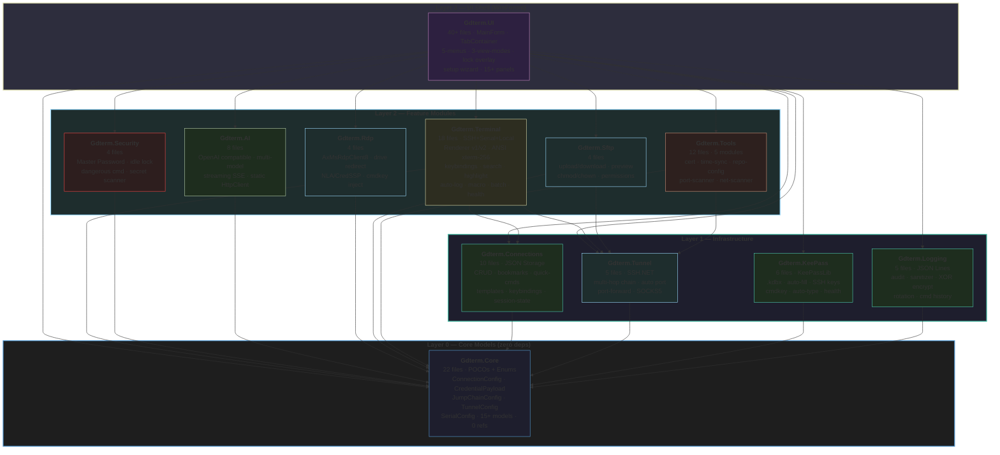

```mermaid
graph TB
    subgraph L3["<b>Layer 3 — UI Shell (WinForms)</b>"]
        UI["<b>Gdterm.UI</b><br/>40+ files · MainForm · TabContainer<br/>5-menus · 3-view-modes · lock overlay<br/>setup wizard · 15+ panels"]
    end

    subgraph L2["<b>Layer 2 — Feature Modules</b>"]
        TERM["<b>Gdterm.Terminal</b><br/>18 files · SSH+Serial+Local<br/>Renderer v1/v2 · ANSI xterm-256<br/>keybindings · search · highlight<br/>auto-log · macro · batch · health"]
        SEC["<b>Gdterm.Security</b><br/>4 files<br/>Master Password · idle lock<br/>dangerous cmd · secret scanner"]
        AI["<b>Gdterm.AI</b><br/>8 files<br/>OpenAI compatible · multi-model<br/>streaming SSE · static HttpClient"]
        RDP["<b>Gdterm.Rdp</b><br/>4 files<br/>AxMsRdpClient8 · drive redirect<br/>NLA/CredSSP · cmdkey inject"]
        SFTP["<b>Gdterm.Sftp</b><br/>4 files<br/>upload/download · preview<br/>chmod/chown · permissions"]
        TOOLS["<b>Gdterm.Tools</b><br/>12 files · 5 modules<br/>cert · time-sync · repo-config<br/>port-scanner · net-scanner"]
    end

    subgraph L1["<b>Layer 1 — Infrastructure</b>"]
        CONN["<b>Gdterm.Connections</b><br/>10 files · JSON Storage<br/>CRUD · bookmarks · quick-cmds<br/>templates · keybindings · session-state"]
        TUN["<b>Gdterm.Tunnel</b><br/>5 files · SSH.NET<br/>multi-hop chain · auto port<br/>port-forward · SOCKS5"]
        KP["<b>Gdterm.KeePass</b><br/>6 files · KeePassLib<br/>.kdbx · auto-fill · SSH keys<br/>cmdkey · auto-type · health"]
        LOG["<b>Gdterm.Logging</b><br/>5 files · JSON Lines<br/>audit · sanitizer · XOR encrypt<br/>rotation · cmd history"]
    end

    subgraph L0["<b>Layer 0 — Core Models (zero deps)</b>"]
        CORE["<b>Gdterm.Core</b><br/>22 files · POCOs + Enums<br/>ConnectionConfig · CredentialPayload<br/>JumpChainConfig · TunnelConfig<br/>SerialConfig · 15+ models · 0 refs"]
    end

    UI --> TERM & SEC & AI & RDP & SFTP & TOOLS & CONN & TUN & KP & LOG & CORE
    TERM --> CONN & TUN & CORE
    SEC --> CORE
    AI --> CORE
    RDP --> CORE
    SFTP --> CORE & TUN
    TOOLS --> CORE & TUN
    CONN --> CORE
    TUN --> CORE
    KP --> CORE
    LOG --> CORE

    style L3 fill:#2d2d3d,stroke:#dcdcaa,stroke-width:2px
    style L2 fill:#1e2d2d,stroke:#9cdcfe,stroke-width:2px
    style L1 fill:#1e1e2d,stroke:#4ec9b0,stroke-width:2px
    style L0 fill:#1e1e1e,stroke:#569cd6,stroke-width:2px

    style UI fill:#2d2040,stroke:#c586c0
    style TERM fill:#2d2d20,stroke:#dcdcaa
    style SEC fill:#2d1e1e,stroke:#f44747
    style AI fill:#1e2d1e,stroke:#b5cea8
    style RDP fill:#1e2d2d,stroke:#9cdcfe
    style SFTP fill:#1e2d2d,stroke:#9cdcfe
    style TOOLS fill:#2d201e,stroke:#ce9178
    style CONN fill:#1e2d1e,stroke:#4ec9b0
    style TUN fill:#1e2d2d,stroke:#9cdcfe
    style KP fill:#1e2d1e,stroke:#4ec9b0
    style LOG fill:#1e2d1e,stroke:#4ec9b0
    style CORE fill:#1e1e2d,stroke:#569cd6
```
